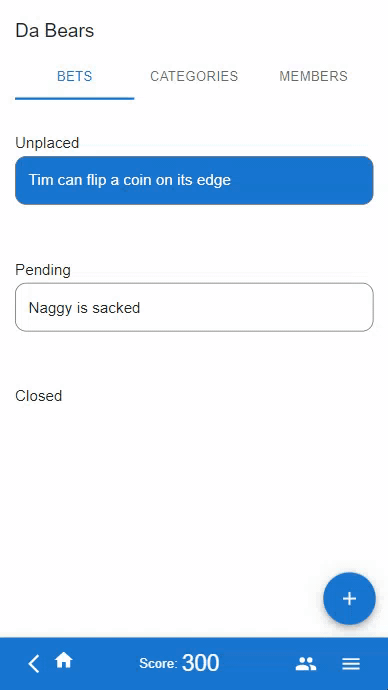
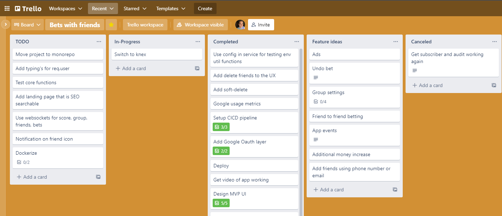

# Bets with Friends <!-- omit in toc -->
[Try it out here!](https://betting-buddies-staging.herokuapp.com/) It might take a second to load. It’s on Heroku and rarely used so they have to spin up a container whenever someone tries to access.

## Table of conents <!-- omit in toc -->
- [Function of app](#function-of-app)
- [Things learned](#things-learned)
  - [Technologically](#technologically)
  - [Product](#product)
  - [Process](#process)

## Function of app
My friends and I were sitting around the bar and making bets on plays during the Bears game. I thought it would be fun to track these bets and gamify the experience of who wins the most bets between friends.

I worked on this project from Aug 2021 through January 2022. After an MVP release and trial period at the end of December I fell out of interest with the idea.

## Things learned
### Technologically
* [Pisma ORM](https://www.prisma.io/)
  * Very cool ORM with awesome generated typing
  * Transaction management was a bit of a challenge
  * Having no lifecycle hooks made it hard to setup and audit trail of DB effects
* Setting up Google OAuth login
* Deploying to Heroku
  * The platform-as-a-service made deploying super easy
  * Very nice to setup an auto-deploy with minimal effort
  * The pipelines look very cool
* UI proxying
  * Setup a local proxy
  * Setup a deployed proxy
* Component library in React
  * [Material-UI, to be specific](https://mui.com/)
  * Very nice for fast prototyping. Instead of messing around with css to make the app bearable it allows for fast iteration.
* config package for complex config management
* 

### Product
* Interactive social apps are hard. Getting people in a social setting to pick up their phone is a contact switch that is very high.
* Easy log-in is very useful for conversion (e.g. Google SSO)

### Process
* Trello kanban board helped track everything
* Markdown notes for the win

